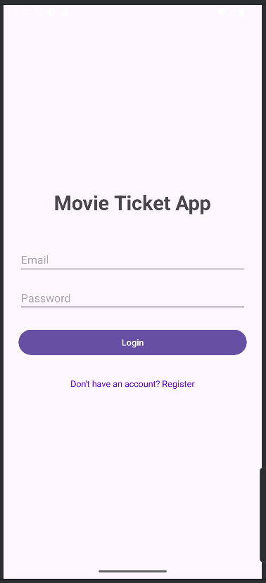
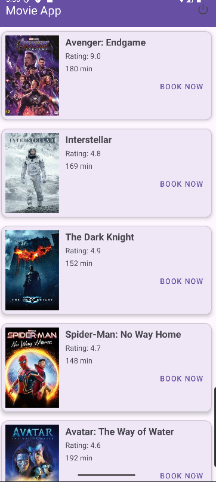
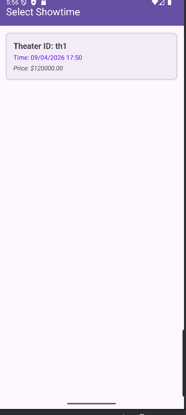

# Movie Ticket App - BTL Group 9

Ứng dụng đặt vé xem phim sử dụng Android Java và Firebase (Auth, Firestore, Messaging).

## Các chức năng chính
- **Đăng nhập/Đăng ký**: Sử dụng Firebase Authentication.
- **Danh sách phim**: Hiển thị danh sách phim đang chiếu từ Cloud Firestore.
- **Lịch chiếu**: Xem các suất chiếu của từng bộ phim theo rạp và thời gian.
- **Đăng xuất**: Quản lý phiên đăng nhập an toàn.

## Hình ảnh ứng dụng

### 1. Màn hình Đăng nhập

### 2. Danh sách phim đang chiếu

### 3. Chọn suất chiếu

## Cấu trúc Firestore
- **users**: Lưu thông tin người dùng (uid, name, email, phone).
- **movies**: Thông tin phim (title, description, rating, duration, poster_url).
- **showtimes**: Lịch chiếu (movie_id, theater_id, start_time, price).

## Cài đặt
1. Clone dự án.
2. Thêm file `google-services.json` vào thư mục `app/`.
3. Build và chạy trên Android Studio (SDK 36).
