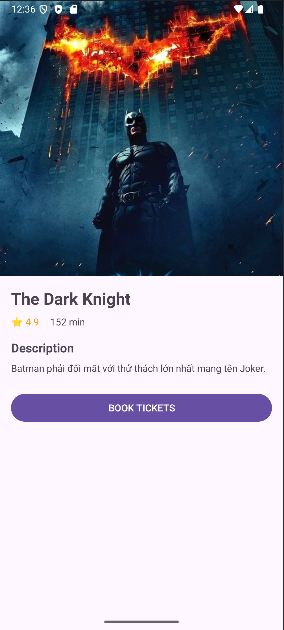
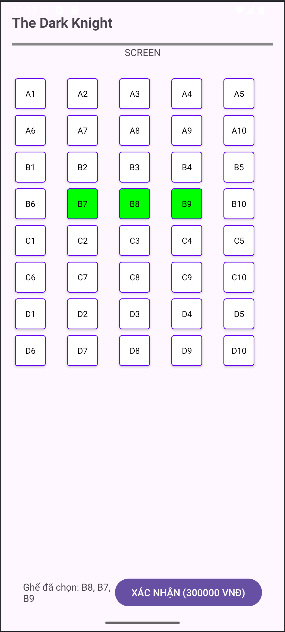

# Movie Ticket App 
# B22DCAT001

Ứng dụng đặt vé xem phim chuyên nghiệp, tích hợp hệ sinh thái Firebase (Auth, Firestore, Messaging) trên nền tảng Android Java.

## 🚀 Các chức năng chính đã hoàn thiện
- **Hệ thống Tài khoản**: 
    - Đăng ký & Đăng nhập bảo mật qua Firebase Auth.
    - Quản lý phiên đăng nhập (Auto-login) và Đăng xuất an toàn.
- **Khám phá Điện ảnh**:
    - **Tìm kiếm thông minh**: Thanh tìm kiếm tại màn hình chính giúp lọc phim nhanh chóng theo tên.
    - **Chi tiết phim (Movie Detail)**: Xem nội dung, đánh giá, thời lượng và poster phim trước khi đặt vé.
    - **Danh sách phim**: Hiển thị danh sách phim đang chiếu thời gian thực từ Cloud Firestore.
- **Quy trình Đặt vé Thông minh**:
    - **Lịch chiếu (Showtimes)**: Xem danh sách suất chiếu linh hoạt theo từng bộ phim.
    - **Chọn ghế (Seat Selection)**: Sơ đồ chọn ghế trực quan (A1 -> D10). Tự động khóa các ghế đã có người đặt để tránh trùng lặp.
    - **Xác nhận đặt vé**: Lưu thông tin vé chi tiết (bao gồm Poster, tên rạp, giờ chiếu) và cập nhật trạng thái ghế trên Database ngay lập tức.
- **Quản lý Cá nhân**:
    - **Lịch sử đặt vé (My Tickets)**: Xem lại danh sách vé đã mua kèm đầy đủ thông tin: Poster phim, vị trí ghế, rạp, thời gian chiếu và tổng tiền.
    - **Trang cá nhân (Profile)**: Xem thông tin tài khoản và quản lý đăng xuất.
- **Thông báo đẩy (FCM)**: Tích hợp Firebase Cloud Messaging để sẵn sàng nhận thông báo nhắc lịch chiếu.

## 📸 Hình ảnh minh họa

### 1. Màn hình Đăng nhập & Đăng ký

### 2. Danh sách phim & Tìm kiếm

### 3. Chi tiết phim & Chọn ghế

## 🛠 Công nghệ sử dụng
- **Android Java**: Ngôn ngữ lập trình chính (Target SDK 36).
- **Firebase Auth**: Xác thực người dùng.
- **Cloud Firestore**: Database NoSQL (Lưu trữ Users, Movies, Showtimes, Tickets).
- **Firebase Messaging (FCM)**: Hệ thống thông báo đẩy.
- **Glide**: Thư viện xử lý và hiển thị hình ảnh poster phim mượt mà.
- **Material Design**: Giao diện người dùng hiện đại, đồng bộ.

## ⚙️ Hướng dẫn cài đặt
1. Mở dự án bằng **Android Studio**.
2. Đảm bảo file `google-services.json` đã được đặt trong thư mục `app/`.
3. Nhấn **Sync Project with Gradle Files**.
4. Chạy ứng dụng trên thiết bị hoặc máy ảo (minSdk 24).
